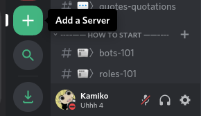

# Creating

## Creating a server

So the time has come, your ready to make your first discord server, dont fret, making a popluar server isnt as hard as one may think, time and effort is all you need to be a successful server owner!

First to create a server scroll down to the bottom of your discords server list, and click the plus + button labeled "Add a Server".

After doing this you will be greeted with a popup that looks like this, since we are trying to create a server rather then join one were going to click "Create a server"

You should now see a screen that asks you to put in the info for your server, dont worry all of this can be changed later! Assumeing you read the previous page on planning, put the info you came up with for your server name/icon here, then we will move onto the next page on setting up channels & more

